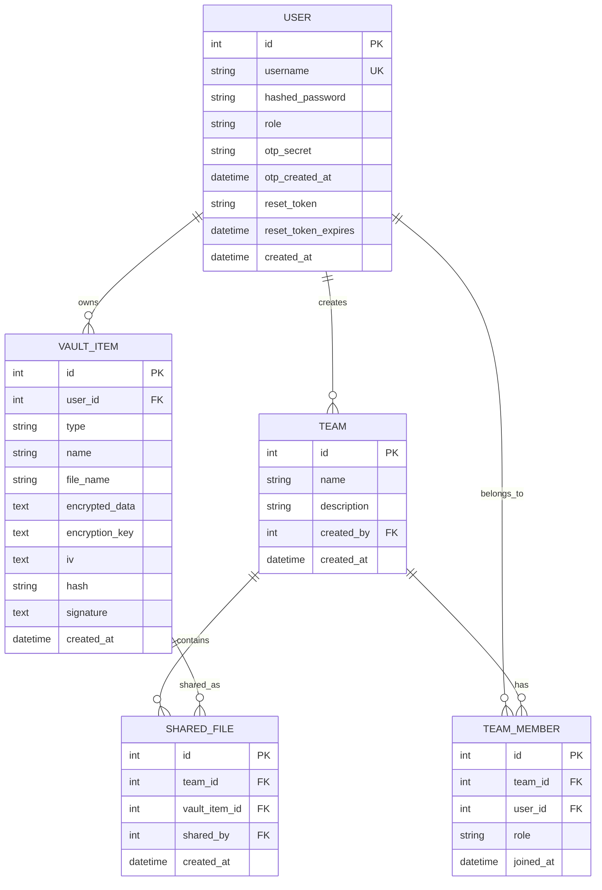

# Database Schema

Documentation of the SQLite database structure used in SecureVault.

## Entity Relationship Diagram



---

## Tables

### users

Stores user account information.

| Column | Type | Constraints | Description |
|--------|------|-------------|-------------|
| id | INTEGER | PRIMARY KEY | Auto-increment ID |
| username | VARCHAR(50) | UNIQUE, NOT NULL | User's login name |
| hashed_password | VARCHAR(255) | NOT NULL | bcrypt hashed password |
| role | VARCHAR(20) | DEFAULT 'user' | 'user' or 'admin' |
| otp_secret | VARCHAR(6) | NULL | Current OTP code |
| otp_created_at | DATETIME | NULL | When OTP was generated |
| reset_token | VARCHAR(64) | NULL | Password reset token |
| reset_token_expires | DATETIME | NULL | Reset token expiry |
| created_at | DATETIME | DEFAULT NOW | Account creation time |

---

### vault_items

Stores all encrypted vault data (passwords, files, notes).

| Column | Type | Constraints | Description |
|--------|------|-------------|-------------|
| id | INTEGER | PRIMARY KEY | Auto-increment ID |
| user_id | INTEGER | FOREIGN KEY → users.id | Owner of the item |
| type | VARCHAR(20) | NOT NULL | 'password', 'file', or 'note' |
| name | VARCHAR(255) | NOT NULL | Label/title for the item |
| file_name | VARCHAR(255) | NULL | Original filename (files only) |
| encrypted_data | TEXT | NOT NULL | Base64-encoded encrypted content |
| encryption_key | TEXT | NOT NULL | Base64-encoded AES key |
| iv | TEXT | NOT NULL | Base64-encoded initialization vector |
| hash | VARCHAR(64) | NOT NULL | SHA-256 hash of plaintext |
| signature | TEXT | NOT NULL | Base64-encoded RSA signature |
| created_at | DATETIME | DEFAULT NOW | When item was created |

**Encrypted Data Format by Type:**

| Type | encrypted_data contains |
|------|------------------------|
| password | JSON: `{"website": "...", "username": "...", "password": "..."}` |
| note | JSON: `{"title": "...", "content": "..."}` |
| file | Raw file binary content |

---

### teams

Stores team information for collaboration.

| Column | Type | Constraints | Description |
|--------|------|-------------|-------------|
| id | INTEGER | PRIMARY KEY | Auto-increment ID |
| name | VARCHAR(100) | NOT NULL | Team name |
| description | TEXT | NULL | Team description |
| created_by | INTEGER | FOREIGN KEY → users.id | Team creator |
| created_at | DATETIME | DEFAULT NOW | When team was created |

---

### team_members

Junction table for team membership.

| Column | Type | Constraints | Description |
|--------|------|-------------|-------------|
| id | INTEGER | PRIMARY KEY | Auto-increment ID |
| team_id | INTEGER | FOREIGN KEY → teams.id | Team reference |
| user_id | INTEGER | FOREIGN KEY → users.id | Member reference |
| role | VARCHAR(20) | NOT NULL | 'owner', 'admin', or 'member' |
| joined_at | DATETIME | DEFAULT NOW | When member joined |

**Role Permissions:**

| Role | Add Members | Remove Members | Share Files | Delete Team |
|------|-------------|----------------|-------------|-------------|
| owner | Yes | Yes | Yes | Yes |
| admin | Yes | Yes | Yes | No |
| member | No | No | No | No |

---

### shared_files

Tracks files shared with teams.

| Column | Type | Constraints | Description |
|--------|------|-------------|-------------|
| id | INTEGER | PRIMARY KEY | Auto-increment ID |
| team_id | INTEGER | FOREIGN KEY → teams.id | Team the file is shared with |
| vault_item_id | INTEGER | FOREIGN KEY → vault_items.id | The shared file |
| shared_by | INTEGER | FOREIGN KEY → users.id | User who shared it |
| created_at | DATETIME | DEFAULT NOW | When file was shared |

---

## Indexes

```sql
-- Fast user lookup
CREATE UNIQUE INDEX idx_users_username ON users(username);

-- Fast vault item queries by user
CREATE INDEX idx_vault_items_user_id ON vault_items(user_id);
CREATE INDEX idx_vault_items_user_type ON vault_items(user_id, type);

-- Fast team member queries
CREATE INDEX idx_team_members_team ON team_members(team_id);
CREATE INDEX idx_team_members_user ON team_members(user_id);

-- Fast shared file queries
CREATE INDEX idx_shared_files_team ON shared_files(team_id);
```

---

## Security Considerations

1. **No plaintext storage**: All sensitive data in `vault_items` is encrypted
2. **Keys per item**: Each vault item has its own encryption key
3. **Hashed passwords**: User login passwords use bcrypt (irreversible)
4. **Foreign key constraints**: Ensure referential integrity
5. **User isolation**: Queries always filter by `user_id` for RBAC
