# Frontend Documentation

This document showcases the user interface and flow of the SecureVault application.

## 1. Landing Page
The entry point of the application.
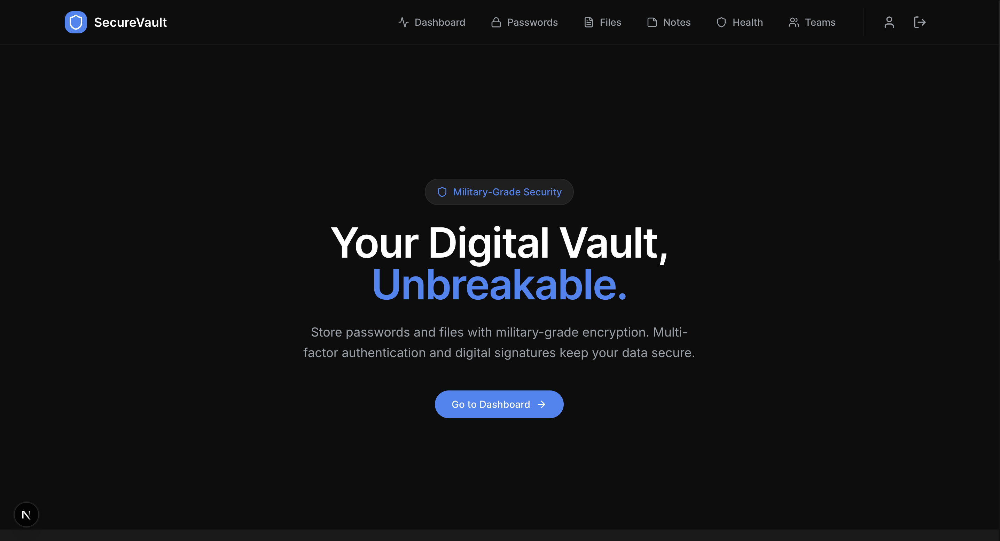

## 2. Authentication

### Sign Up
New users can register for an account.
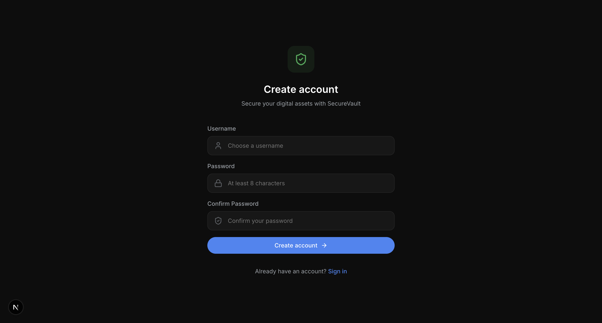

### Login
Secure login with username and password.
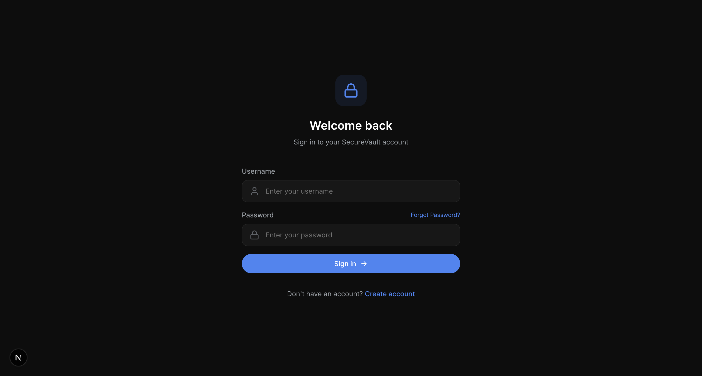

### Forgot Password
Flow to initiate password reset.
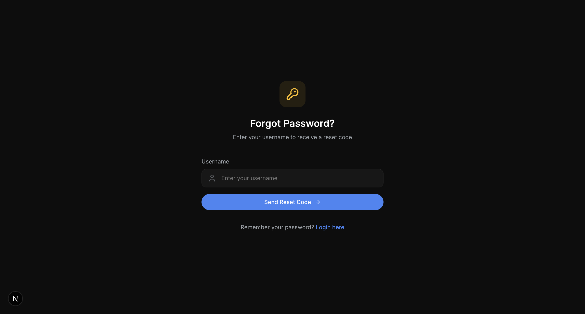

### Reset Password
Enter the reset token and new password.
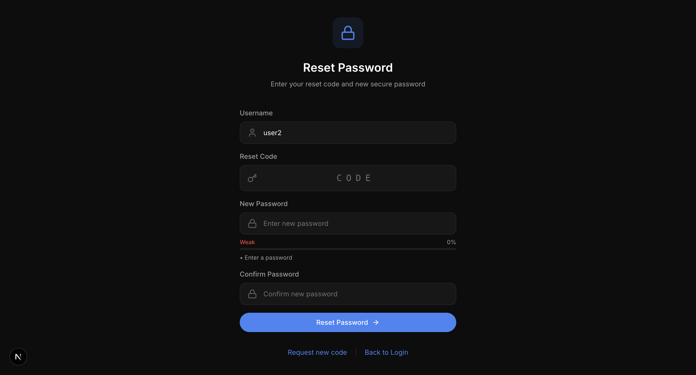

## 3. Dashboard
The main overview of the user's vault.
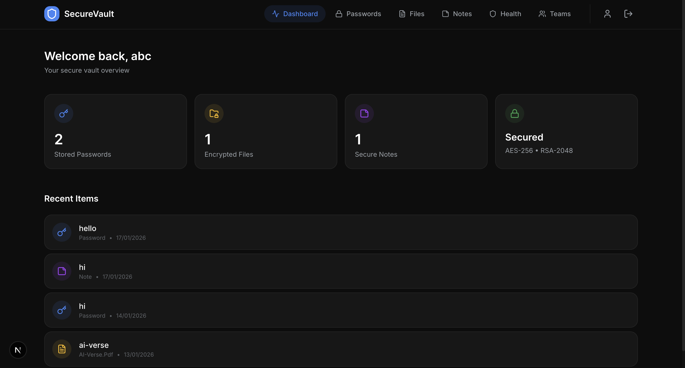

## 4. Vault Management

### Passwords
Manage your stored passwords securely.
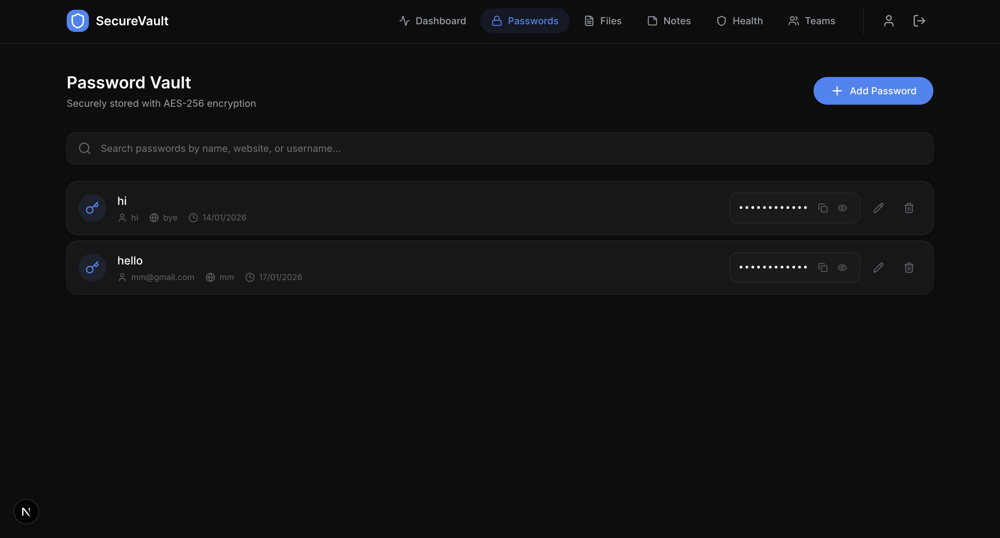

### Password Analysis
Check the strength and health of your passwords.
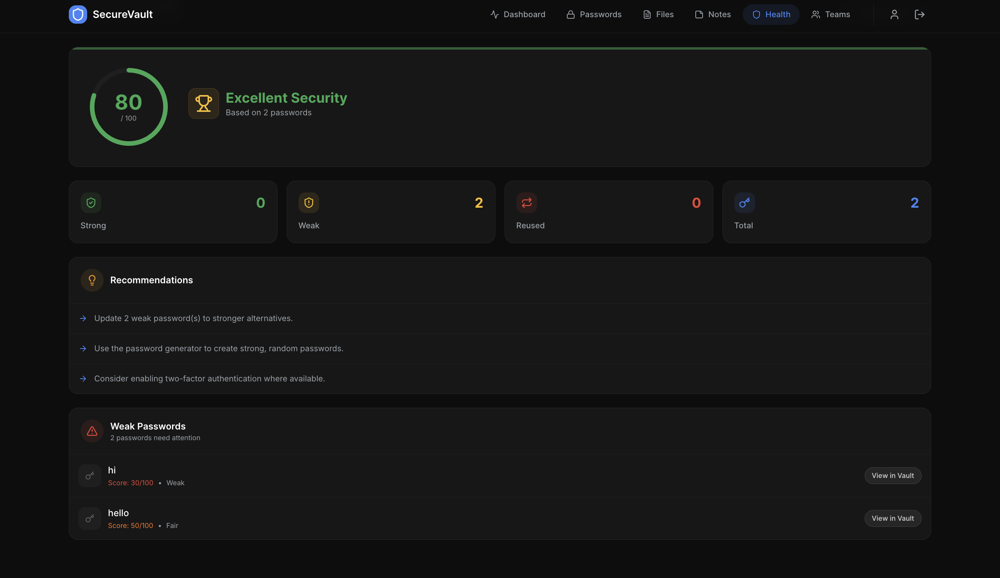

### Secure Files
Upload and manage encrypted files.

### Secure Notes
Keep your private notes encrypted.
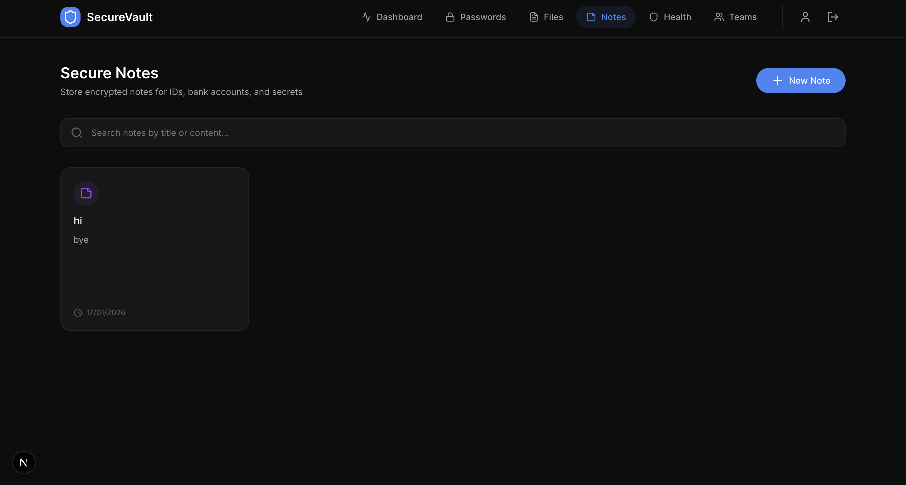

## 5. Collaboration

### Teams
Manage teams and share files securely.
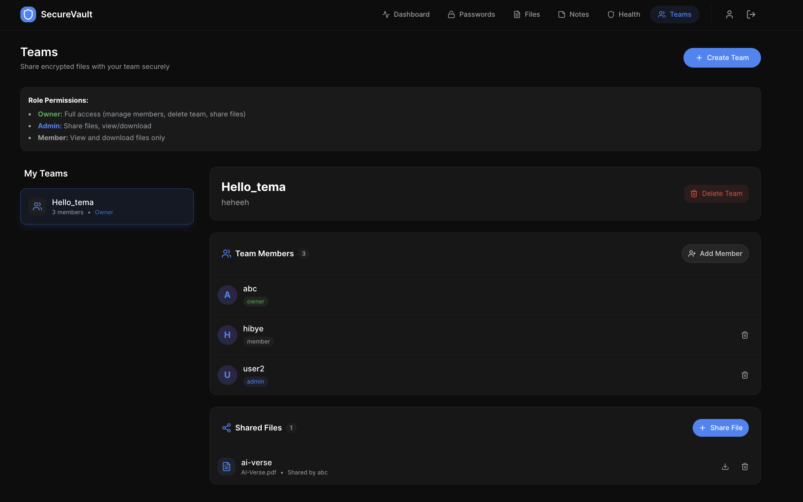

## 6. User Settings

### Profile
Manage your account settings and view profile information.
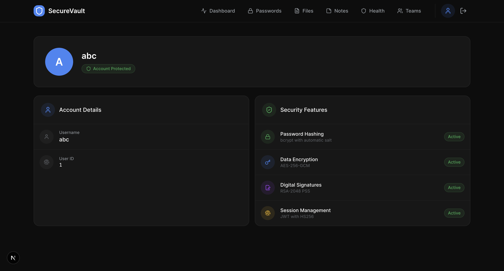
