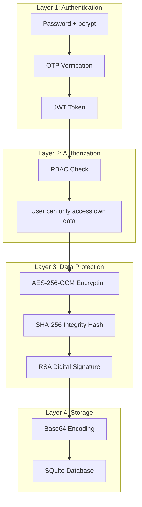
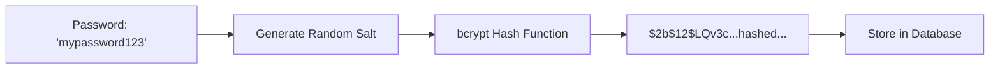
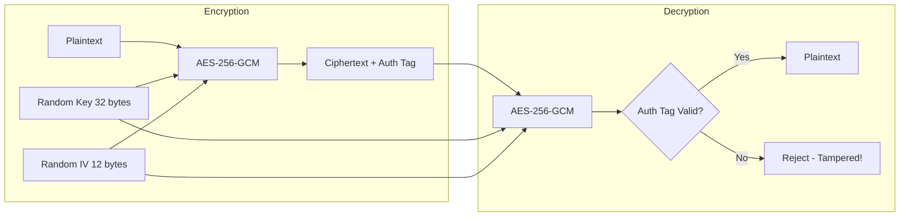
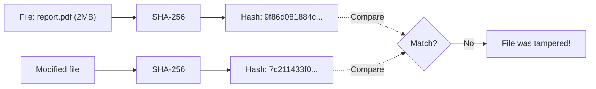
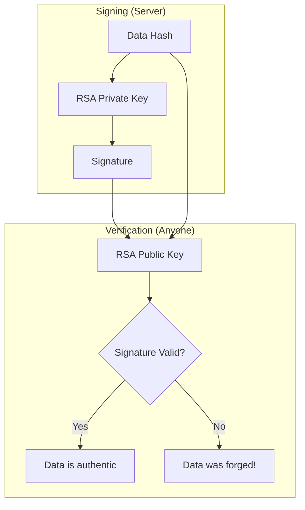
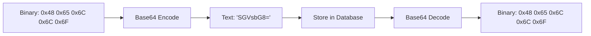
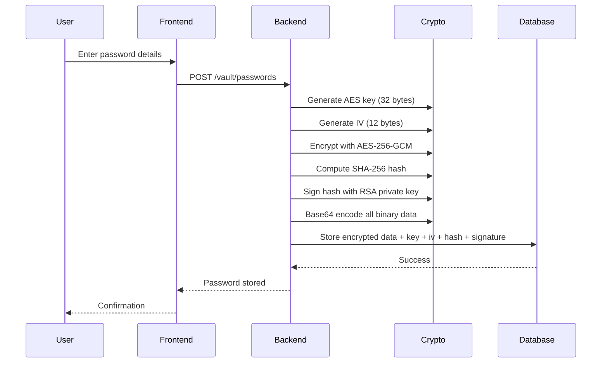
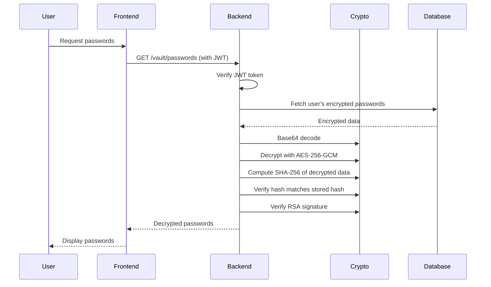
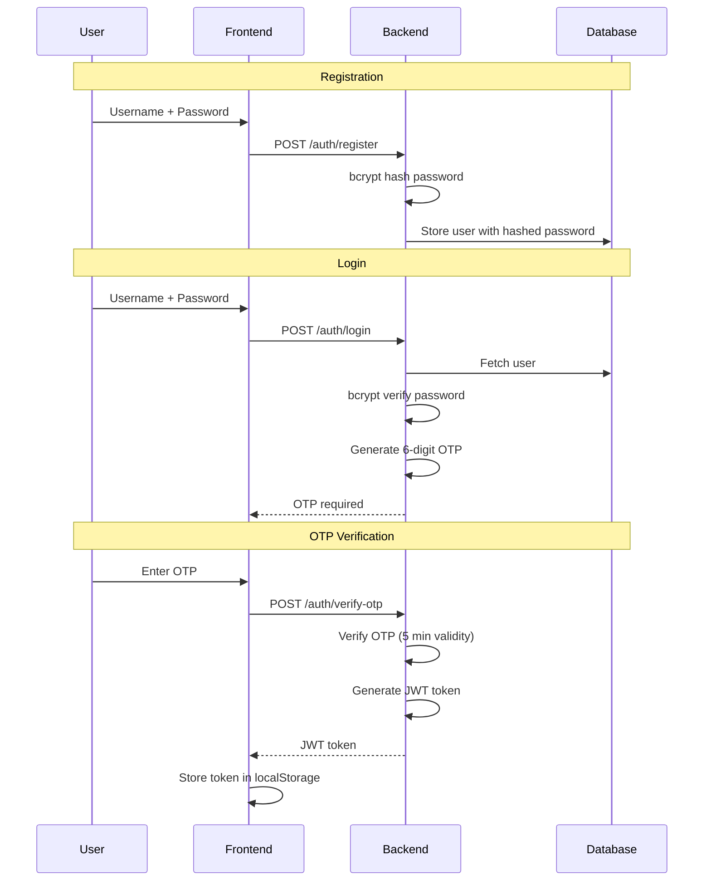

# SecureVault Security Architecture

This document explains the security mechanisms used in SecureVault and why each was chosen.

## Overview

SecureVault implements defense-in-depth security with multiple layers:

---

## Cryptographic Components

### 1. bcrypt (Password Hashing)

**What it does:** Converts user login passwords into irreversible hashes.

**Why bcrypt (not SHA-256 or MD5)?**

| Algorithm | Speed | Security |
|-----------|-------|----------|
| MD5 | Very fast | Broken, collisions found |
| SHA-256 | Very fast | Secure but too fast for passwords |
| bcrypt | Intentionally slow | Designed for passwords |

bcrypt is slow by design - this makes brute-force attacks impractical:
- SHA-256: Attacker can try billions of passwords/second
- bcrypt: Attacker limited to thousands/second

**Code location:** `backend/crypto/password.py`

---

### 2. AES-256-GCM (Data Encryption)

**What it does:** Encrypts vault data (passwords, files, notes) so only the key holder can read them.

**Why AES-256-GCM (not AES-CBC or RSA)?**

| Mode | Confidentiality | Integrity | Performance |
|------|-----------------|-----------|-------------|
| AES-CBC | Yes | No (needs separate MAC) | Fast |
| AES-GCM | Yes | Yes (built-in) | Fast |
| RSA | Yes | No | Slow, size-limited |

GCM mode provides authenticated encryption - it detects if ciphertext was modified.

**Key details:**
- Key size: 256 bits (32 bytes) - military-grade
- IV size: 96 bits (12 bytes) - unique per encryption
- Fresh random key generated for each vault item

**Code location:** `backend/crypto/aes.py`

---

### 3. SHA-256 (Integrity Hashing)

**What it does:** Creates a unique fingerprint of data to detect modifications.

**Why SHA-256?**
- Produces 256-bit hash (64 hex characters)
- Collision-resistant (no two different inputs produce same hash)
- Industry standard for integrity verification

**Code location:** `backend/crypto/hashing.py`

---

### 4. RSA-2048 with PSS (Digital Signatures)

**What it does:** Proves data originated from this server and hasn't been tampered.

**Why RSA-PSS (not PKCS#1 v1.5)?**
- PSS (Probabilistic Signature Scheme) is more secure
- Resistant to known padding attacks
- Same message signed twice produces different signatures (added randomness)

**Key details:**
- Key size: 2048 bits
- Private key: Signs data (kept secret on server)
- Public key: Verifies signatures (can be shared)

**Code location:** `backend/crypto/rsa.py`

---

### 5. Base64 (Encoding)

**What it does:** Converts binary data to text for storage/transport.

**Why Base64?**
- SQLite and JSON handle text better than raw binary
- Safe for HTTP transmission
- Reversible (not encryption, just encoding)

**Code location:** `backend/crypto/encoding.py`

---

## Complete Data Flow

### Storing a Password

### Retrieving a Password

---

## Authentication Flow

---

## Why This Architecture is Secure

| Threat | Protection |
|--------|------------|
| Password database theft | bcrypt makes passwords uncrackable |
| Vault data theft | AES-256 encryption - data is unreadable |
| Data tampering | SHA-256 + RSA signature detects changes |
| Unauthorized access | JWT + RBAC - users see only their data |
| Session hijacking | JWT expiration limits window |
| Brute force login | OTP adds second factor |
| Replay attacks | Unique IV per encryption |

---

## Key Storage Summary

| Key Type | Location | Purpose |
|----------|----------|---------|
| User password hash | `users.hashed_password` | Login verification |
| AES encryption key | `vault_items.encryption_key` | Data encryption (per item) |
| AES IV | `vault_items.iv` | Encryption randomization |
| RSA private key | `backend/keys/private_key.pem` | Signing |
| RSA public key | `backend/keys/public_key.pem` | Signature verification |
| JWT secret | `backend/auth/jwt.py` | Token signing |
